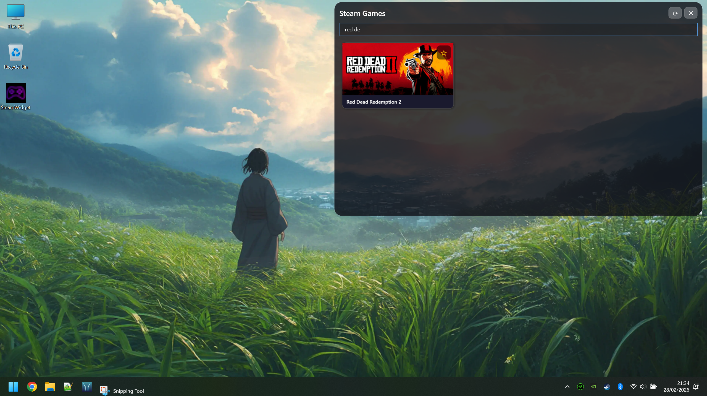

# 🎮 SteamWidget

> A beautiful, lightweight Steam game launcher that lives on your Windows desktop.

---

## ✨ Features

- 🖼️ **Steam Deck-style game cards** — full artwork, proper 460×215 header ratio, smooth hover glow
- ⭐ **Favourites** — pin your most-played games to the top with a gold glow border, persists across restarts
- 🔍 **Live search** — instantly filter your entire library as you type
- 💾 **Remembers everything** — window position and size are saved on close and restored on next launch
- 🚀 **Starts with Windows** — automatically launches on login, always ready
- ⚡ **Loads from local cache** — reads artwork directly from Steam's own cache on your hard drive, no internet needed after first run
- 🟣 **Custom gamepad icon** — shows in File Explorer, taskbar and Alt+Tab
- ✕ **Red close button** — turns red on hover so you always know what you're clicking
- 🪟 **Transparent, borderless window** — floats cleanly over your wallpaper
- 🔄 **Refresh button** — rescan your library any time

---

## 📸 Screenshots

| Main View | Favourites | Search |
|-----------|------------|--------|
|  |  |  |

---

## 🚀 Getting Started

### Download
Head to the [**Releases**](../../releases) page and download the latest `SteamWidget.exe`.  
It's a **single self-contained file** — no installer, no .NET required on your PC.

### Run
Just double-click `SteamWidget.exe`. That's it.

> **First run on a new PC?** Windows SmartScreen may show a blue warning because the app isn't code-signed. Click **"More info" → "Run anyway"** — this is safe and only happens once.

---

## 🕹️ How to Use

| Action | How |
|--------|-----|
| **Launch a game** | Click any game card |
| **Favourite a game** | Click the ★ star on the card |
| **Search** | Type in the search box at the top |
| **Move the widget** | Click and drag the title bar |
| **Resize** | Drag the bottom-right corner |
| **Refresh library** | Click the ⟳ button |
| **Close** | Click the ✕ button (turns red on hover) |

---

## 📁 Data & Privacy

SteamWidget stores two small files locally on your PC — nothing is sent anywhere:

| File | Location | Contents |
|------|----------|----------|
| Window settings | `%APPDATA%\SteamWidget\window.json` | Position and size |
| Favourites | `%APPDATA%\SteamWidget\favourites.json` | Your starred game IDs |
| Image cache | `%APPDATA%\SteamWidget\icons\` | Downloaded artwork (only for games not already in Steam cache) |

---

## 🛠️ Tech Stack

- **C# / WPF** (.NET 8, Windows)
- **XAML** for UI
- Reads Steam library from local `.acf` manifest files and Windows Registry
- Artwork loaded from `Steam\appcache\librarycache\` — your local disk

---

## 📋 Requirements

- Windows 10 or Windows 11
- Steam installed
- At least one game installed via Steam

---

## 🤝 Contributing

Pull requests are welcome! If you find a bug or have a feature idea, open an [Issue](../../issues).

Ideas for future features:
- [ ] Last played / playtime sorting
- [ ] Category / tag filtering
- [ ] Mini compact mode
- [ ] Custom background/theme colors
- [ ] Non-Steam game support

---

## 📄 License

MIT License — free to use, modify and share.

---

Made with ❤️ for gamers who like their desktop clean but their games close.

